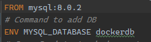
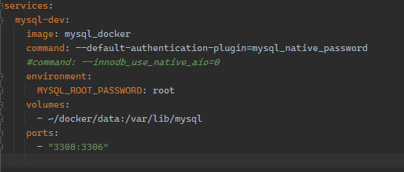

<h1 align="center"> Spring-RestAPI </h1>

Spring RestAPI + (MySQL + Docker) en un par de comandos.
Incluye archivo para auto-popular la DB.

## Getting Started
### Config 
###### Dockerfile


* FROM establece version de MySQL ( check [Dockerhub](https://hub.docker.com/) )
* ENV crea la DB

###### docker-compose.yml

* image: Nombre de la imagen que utilizaremos.
* command: Comandos para desarrollo.
* volumes: `~/docker/data` establece el path donde se maneja la persistencia de la DB (en windows seria `/users/(usuario)/docker/data`).

### Executing program
######Crear imagen:
* En la carpeta que contiene al Dockerfile corremos el comando.
* Establecemos el nombre de la imagen con -t.  

```
docker build -t mysql_docker .
```

######Correr contenedor:
* -d para ocultar los logs.
* Establecemos el nombre de la imagen con -t.  

```
docker-compose up -d
```
